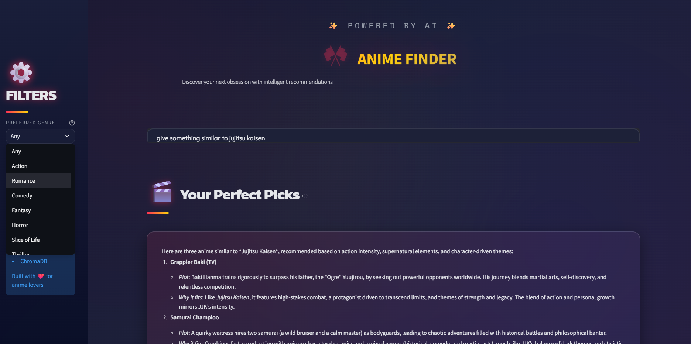

## 🎌 AI Anime Movie Recommendation System (RAG Based)..

An AI-powered Anime Recommendation System built using Retrieval-Augmented Generation (RAG) pipeline.  
This system recommends anime based on user queries using LLM + Vector Database.


## 🚀 Features

- 🔎 Semantic Search using Vector Database
- 🤖 LLM-based Response Generation
- 📂 CSV-based Anime Dataset
- 🐳 Docker Support
- ☸ Kubernetes Deployment (llmops-k8s.yaml)

---

## 🛠 Tech Stack

- Python
- LangChain
- HuggingFace Embeddings
- ChromaDB
- FastAPI / Streamlit (if used)
- Docker
- Kubernetes

---

## 📊 Project Architecture

User Query → Embedding → Vector Search → Relevant Context → LLM → Final Recommendation

---

## 📸 Output Screenshot



---

## ⚙ Installation

```bash
git clone https://github.com/sneha-jagtap-patil/AI-anime-movie-recommender.git
cd AI-anime-movie-recommender
pip install -r requirements.txt
```

Run the application:

```bash
python app/app.py
```

---

## 🐳 Docker Run

```bash
docker build -t anime-recommender .
docker run -p 8000:8000 anime-recommender
```

---

## ☸ Kubernetes Deployment

```bash
kubectl apply -f llmops-k8s.yaml
```...........


## 📂 Dataset

- anime_updated.csv
- anime_with_synopsis.csv

---

## 👩‍💻 Author

Sneha Patil  ........
AI & ML Enthusiast 🚀

